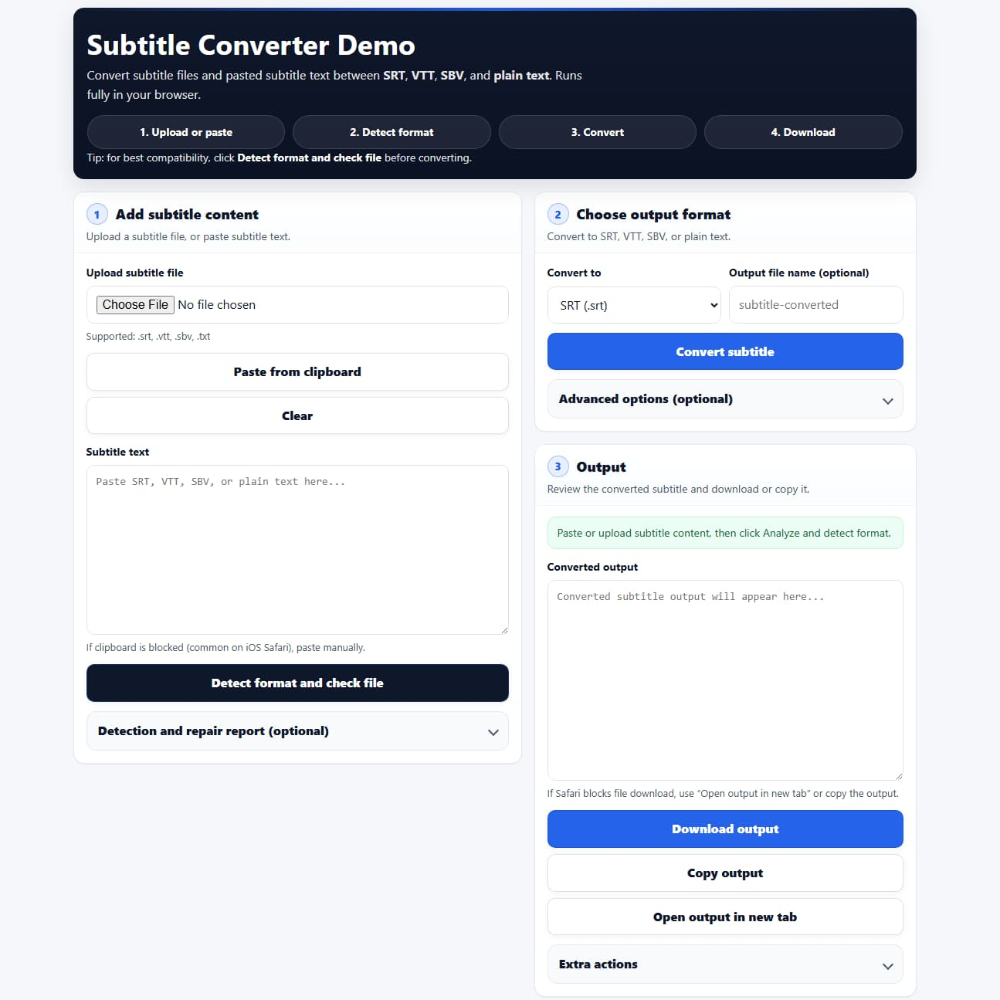

# Subtitle Converter (SRT, VTT, SBV, Text)

Client-side subtitle converter written in JavaScript. Upload or paste subtitle content and convert between:

- SRT (.srt)
- WebVTT / VTT (.vtt)
- SBV (.sbv)
- Plain text (.txt)

The converter detects the real format from the content (not only from the file extension), can flag common issues (missing headers, malformed timing lines, overlap problems, unsupported formatting), and can normalize output for wide compatibility.

## Live demo (CasinoLove)

- App: http://tech.casinolove.org/subtitle-conversion/app/
- Subtitle format guide (SRT, VTT, SBV): http://tech.casinolove.org/subtitle-conversion/

Note: the example HTML included in this repository exposes more options than the hosted CasinoLove page.

## Screenshot



## Features

- Runs fully in the browser (no server required)
- Works with uploaded files or pasted subtitle text
- Content-based format detection (SRT vs VTT vs SBV vs text)
- Optional repair and normalization:
  - adds missing `WEBVTT` header
  - fixes common timestamp formatting issues (comma vs dot)
  - handles missing SRT numbering by renumbering on export
  - swaps `end < start`, avoids zero-length cues, and clips simple overlaps
  - simplifies formatting tags for compatibility
- Export as SRT, VTT, SBV, or plain text
- iOS Safari friendly fallbacks for clipboard and file download

## Repository contents

- `subtitle-converter.js`  
  The converter logic (parsing, detection, normalization, export).

- `example.html`  
  A generic demo page that wires UI to the JS logic.

## Quick start

Option 1: open locally

1. Download this repository.
2. Open `example.html` in your browser.

Option 2: serve locally (recommended)

Any static server works. Examples:

Python:

```bash
python -m http.server 8000
